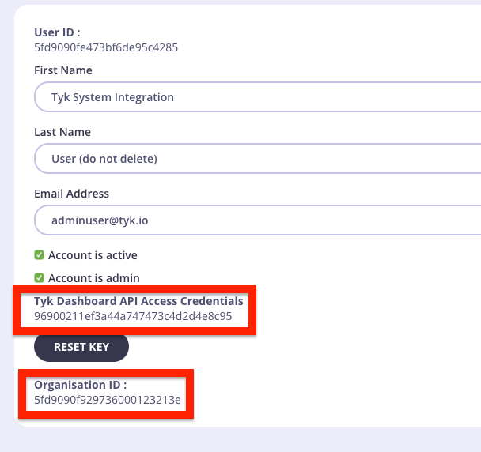

On a new install of Tyk, whether on-prem or Tyk Cloud, you need to bootstrap the Tyk Dev Portal in order to get past this error and others.

```
Home Page Not Found
```

This script will bootstrap a default Portal, information from [portal-home-page.json](./portal-home-page.json)


### How to use

1. Add your environment configs to the [bootstrap_portal.sh](./bootstrap_portal.sh) script.  Your user API key and Organization ID come from the User Profile screen.



2. Run the script

```
$ chmod +x ./bootstrap_portal.sh
$ ./bootstrap_portal.sh
Mon Dec  7 19:07:04 UTC 2020 Creating Portal for organisation 
Mon Dec  7 19:07:04 UTC 2020   Creating Portal default settings
Mon Dec  7 19:07:04 UTC 2020   Ok
Mon Dec  7 19:07:04 UTC 2020   Initialising Catalogue
Mon Dec  7 19:07:05 UTC 2020   Ok
Mon Dec  7 19:07:05 UTC 2020   Creating Portal home page
Mon Dec  7 19:07:05 UTC 2020   Ok
```
